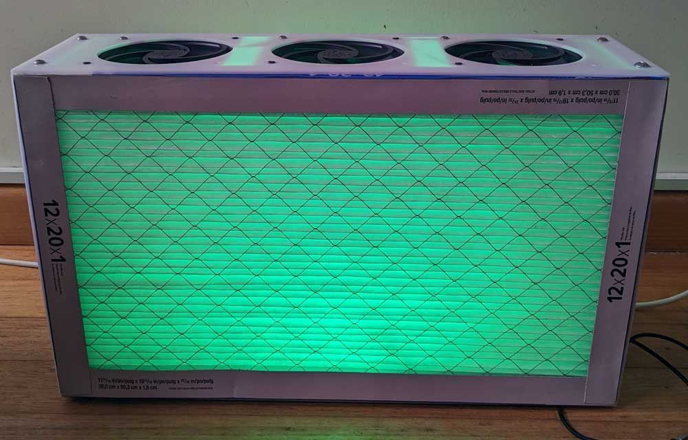

# Half sized slim CR Box using PC fans

Instructions for building a small CR box using silent, low power PC fans, sufficient for a normal room of 25-35m², or maximum of 9 people.

# Content

- [Background](#background)
- [Part list](#part-list)
- [Assembly](#assembly)
- [ToDos](#todos)

## Background

[Corsi Rosenthal boxes](https://en.wikipedia.org/wiki/Corsi%E2%80%93Rosenthal_Box) have been proven to be a powerful way of providing clean air when natural air flow cannot be achieved (e.g. in colder climates or indoor areas that cannot be sufficiently ventilated). Originally these were mainly built from large (20 x 20 inch / 500 x 500 mm) filter panels and large box fans. Since box fans can be loud enough to be disturbing in certain settings, as well as hard to source locally, more recent designs use multiple pressure optimised PC fans instead, that are much quieter, efficient and also avoid challenges that one might be facing using a mains voltage appliance in a DIY project.

The fans used in this project are designed to achieve 95.7 m³/h airflow each at only 0.3 sone and 1.2W power consumption [spec sheet](https://www.arctic.de/media/f5/5f/2e/1661323426/Spec_Sheet_P12_PWM_PST_EN.pdf).

## Capacity

The WHO recommends 4-6 air changes per hour (ACH), approximately the equivalent of 800ppm CO2 when using natural ventilation. The 5 fans deliver ca. 475 m³/h, which will clean 60 (8 ACH) to 80 (6 ACH) m³, or, at a ceiling height of 2.3m, **_a room of 25-35m²_**.
Alternatively and taking the number of occupants into account, the WHO recommends 14.2 l/person/second, which translates to a capacity of 475 m³/h = 132 l/sec = **_9.3 persons_** @ 14.2 l/second.

# Fan controller

See [here](https://github.com/oseiler2/CR-Box-Monitor) for an intgrated fan controller and CO2 monitor that works well in this box.

# Part list

| Component                       | Description                                     | Notes                                                                                                              | Amount | Indicative cost | Supplier                                                                                                                       |
| ------------------------------- | ----------------------------------------------- | ------------------------------------------------------------------------------------------------------------------ | ------ | --------------- | ------------------------------------------------------------------------------------------------------------------------------ |
| filter panels                   | 12x20x1 sized MERV13                            |                                                                                                                    | 2      | $100            | [Amazon AU](https://www.amazon.com.au/s?k=12x20x1+merv+13+filter)                                                              |
| fans                            | 120mm pressure optimised Arctic P12             | Value pack of 5. Other variants of the P12 (with LEDs, without PWM) will also work                                 | 5      | $65             | [Amazon AU](https://www.amazon.com.au/gp/product/B07HC782D5/)                                                                  |
| fan guards                      |                                                 | optional - to stop little fingers of pets reaching into the fans                                                   | 5      | $12             | [AliExpress](https://www.aliexpress.com/item/4000118091590.html)                                                               |
| fan screws + nuts               | M4x35mm, only if using fan guards               | fan-included screws are too short for fan guards                                                                   | 20     |                 | [AliExpress](https://www.aliexpress.com/item/32966157667.html), [AliExpress](https://www.aliexpress.com/item/32978551452.html) |
| acrylic panels                  | laser cut from 3mm slightly translucent acrylic | Provide these files: [bottom](res/bottom.svg), [top](res/top.svg), [left](res/side01.svg), [right](res/side02.svg) | 1 each | $85             | [Graley Plastics](https://www.graleyplastics.co.nz)                                                                            |
| plywood panels                  | alternatively use plywood                       | Adjust bottom/top length for plywood thickness.                                                                    | 1 each |                 |                                                                                                                                |
| internal corners                | 120x\~20x\~20mm wood                            | I've used 2020 extrusions that I had available                                                                     | 4      |                 |                                                                                                                                |
| panel screws                    | <= M5                                           |                                                                                                                    | 16     |                 |                                                                                                                                |
| USB-C charger                   | 12V capable USB-C PD wall charger               | Upcycled phone charger, or other fixed 12V (>=2A) power supply                                                     | 1      |                 |                                                                                                                                |
| USB-C power                     | 12V USB-C PD 5.5x2.1mm barrel cable             | Make sure to choose 12V version                                                                                    | 1      | $6.00           | [AliExpress](https://www.aliexpress.com/item/1005004477437199.html)                                                            |
| 5.5x2.1mm barrel to fan adapter | when using above cable                          |                                                                                                                    | 1      | $4.50           | [AliExpress](https://www.aliexpress.com/item/1005004241991599.html)                                                            |
| USB-C power                     | 12V USB-C PD PCB                                | Small PCB for direct soldering. Make sure to choose 12V version                                                    | 1      | $1.60           | [AliExpress](https://www.aliexpress.com/item/1005004477437199.html)                                                            |
| rubber feet                     |                                                 | optional                                                                                                           | 4      |                 |                                                                                                                                |
| carry handle                    |                                                 | optional                                                                                                           | 1      |                 |                                                                                                                                |
| LEDs                            |                                                 | optional                                                                                                           |        |                 |                                                                                                                                |

# Assembly

1. Mount the fans to the inside of the side and top panels. Ensure that the airflow of each fan is through the panel and out (there are small markers printed on the fan case indicating direction of rotation and direction of airflow). When not using fan guards you can use the self-taping screws that ship with the fans. Otherwise use 35mm long M4 screws from the outside through the fan guard, panel and fan and fasten with a hex nut.
2. Screw the 4 internal 120mm long corners to the inside of the side panels, making sure they're flush against the top/bottom of the panels, and centred.
3. Add the top and botton panels to the side panels and screw them to the internal corners while making sure the top and bottom panels are flush against the external face of the side panels. The hole in one of the side panels is for the power cable and should be at the bottom.
4. Connect the fans by plugging each into the plug at the end of the previous fan's cable.
5. If you are using a barrel connector for power supply enlarge the hole in the side panel with a drill to fit the barrel plug. Install barrel plug. Otherwise install power cable through the side panel hole and secure on the inside with a cable tie.
6. Connect the power cable or barrel plug with the plug of the first fan. I've used a pin header for the plug, but you can also get a proper connector, or conncet the wires directly. See image for 
7. Connect to power supply and check that the fans are spinning up.
8. Tidy up all cables and ensure they won't obsctruct the filter panels that will later be flush against the sides of the fans.
9. Install colour LED and/or CO2 monitor if/as needed. The PWM fan input can be used to control the fan speed and the sense output can be used to measure actual fan speed (10k pull up resistor required).
10. Push filter panels into the frame. Mine where slightly over their specified dimensions and a tight fit.

[fan drawings](https://support.arctic.de/products/p12-pwm-pst/techdocs/P12%20Series%20-%202D%20Drawing.pdf)

Note: panels slightly oversized, adjust plans accordingly.
Note: when using plywood adjust bottom/top length for plywood thickness.

# Todos

- [ ] add more photos
- [ ] update plans with measurements
